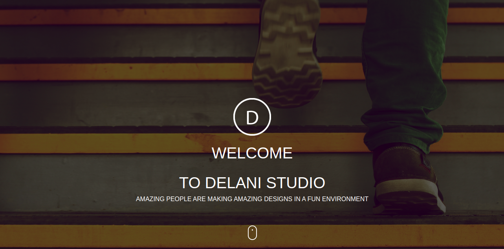

# Delani Studio
#### A company that offers interactive designs, product magement and development of technologies, version : 2020
#### By **Cecilia Barasa**
## Description
The design practice offers a full range of services including brand strategy, interaction and visual design and user experience testing. it includes a team of  engineers who are fluent in the latest enterprise, mobile and web development technologies. The development process allows for changes as business requirements evolve.
## [Live Site](https://cecibarasa.github.io/Delani-studio/)
## Screenshot

## Setup/Installation Requirements
* ` Google Chrome`
## Technologies Used
* ` HTML`
* ` CSS`
* ` JAVASCRIPT`
* ` BOOTSTRAP`
* ` JQUERY`
* ` MARKDOWN`
## [Support and contact details](https://www.linkedin.com/in/cecilia-barasa-4a8311195/)
### [License](https://github.com/cecibarasa/Delani-studio/blob/master/license.md)
Copyright (c) 2020 **Cecilia Barasa**
